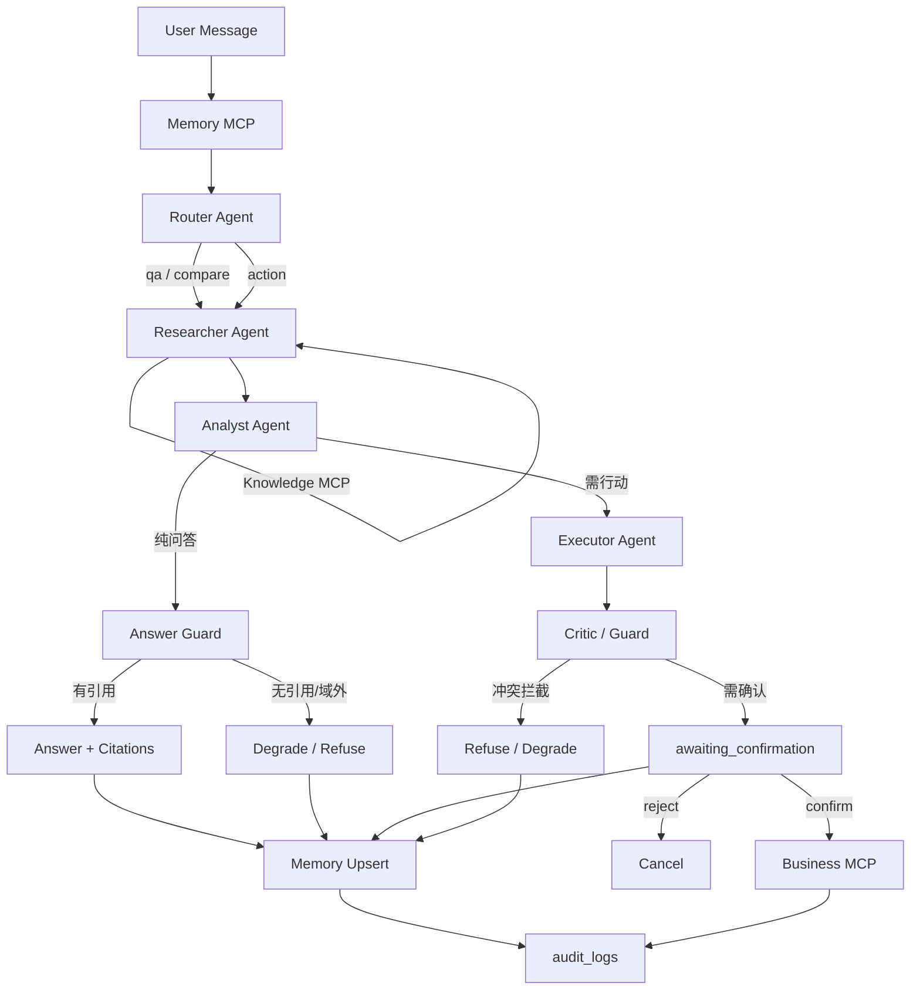

# Agent Graph（阶段 5：Memory + Guard 增强 + 评测）

> 阶段 5：Memory MCP、Answer Guard（无引用/域外降级）、行动 Guard、`run_eval.py` 已接线。

## Mermaid

## 节点

| Agent | 阶段可用 |
|-------|----------|
| Memory | ✅ 阶段 5 |
| Router | ✅ |
| Researcher | ✅ |
| Analyst | ✅ |
| Executor | ✅ 阶段 4 |
| Critic / Guard | ✅ 阶段 5（问答降级 + 行动冲突） |

## 扩展点清单

| 扩展点 | 位置 | MVP |
|--------|------|-----|
| LLM Provider | `packages/llm` | Chat/Embed 已实现 |
| DocumentParser | `packages/parsers` | Markdown/Text；PDF 后挂 |
| AuthProvider | `packages/auth` | NoAuth / DevHeader |
| MCP Servers | `mcp_servers/*` | Knowledge / Memory / Business 就绪；Comms 骨架 |

代码：`ka_orchestrator.pipeline` / `scripts/run_eval.py` / `tests/test_guardrails.py`。
