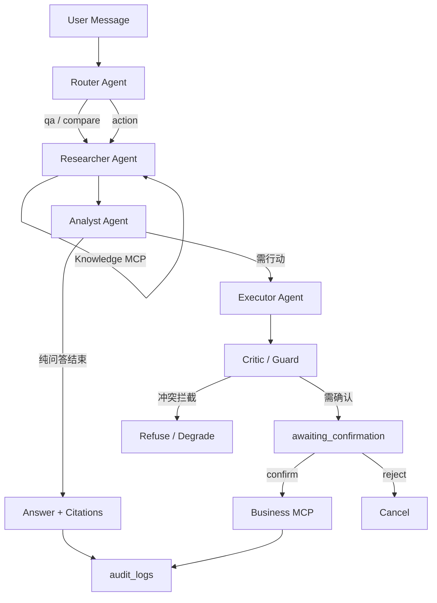

# Agent Graph（阶段 4：Executor + Guard + 确认闸门已接线）

> 阶段 4：行动须确认后才写 Business tickets；Executor / Guard 已跑通。

## Mermaid

## 节点

| Agent | 阶段可用 |
|-------|----------|
| Router | ✅ |
| Researcher | ✅ |
| Analyst | ✅ |
| Executor | ✅ 阶段 4 |
| Critic / Guard | ✅ 阶段 4（MVP 硬规则；阶段 5 再增强） |

## 扩展点清单

| 扩展点 | 位置 | MVP |
|--------|------|-----|
| LLM Provider | `packages/llm` | Chat/Embed 已实现 |
| DocumentParser | `packages/parsers` | Markdown/Text；PDF 后挂 |
| AuthProvider | `packages/auth` | NoAuth / DevHeader |
| MCP Servers | `mcp_servers/*` | Knowledge / Business 就绪；Memory 骨架 |

代码：`ka_orchestrator.pipeline` / `confirmation` / `scripts/demo_cli.py --action`。
