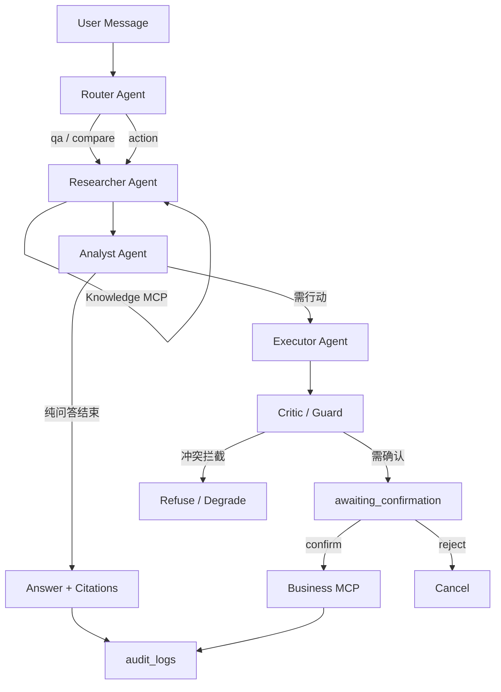

# Agent Graph 草图（阶段 0 冻结）

> 执行逻辑在阶段 2 接线；本文件仅冻结拓扑与扩展点。

## Mermaid

## 节点

| Agent | 阶段可用 |
|-------|----------|
| Router | 阶段 2 |
| Researcher | 阶段 2 |
| Analyst | 阶段 2 |
| Executor | 阶段 4 |
| Critic / Guard | 阶段 4–5 |

## 扩展点清单

| 扩展点 | 位置 | MVP |
|--------|------|-----|
| LLM Provider | `packages/llm` | `VolcengineDoubaoProvider`（chat/embed 阶段 1–2 实现） |
| DocumentParser | `packages/parsers` | `MarkdownParser` / `TextParser`；PDF/DOCX 后挂 |
| AuthProvider | `packages/auth` | `NoAuthProvider` / `DevHeaderAuthProvider`；JWT 后挂 |
| MCP Servers | `mcp_servers/*` | Knowledge/Memory/Business 骨架；Comms 二期 |

代码侧同源：`apps/orchestrator/src/ka_orchestrator/graph.py`，可通过 `GET /graph` 读取。
